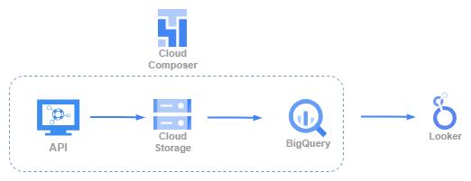
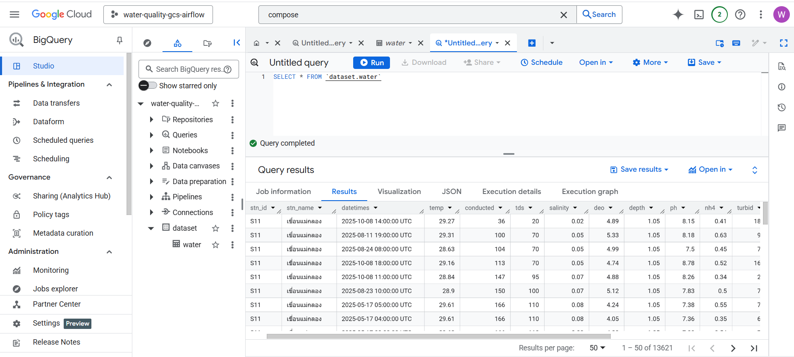
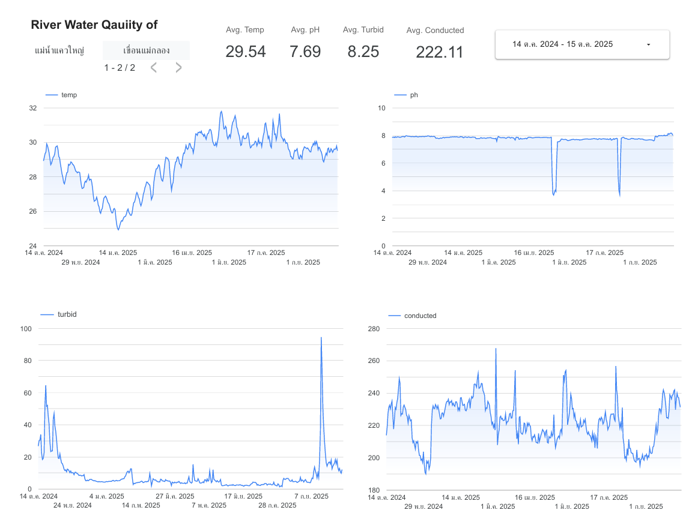

# 💧 Water Quality Pipeline with Airflow

## 🎯 Objective
The objective of this project is to build a cloud-native data pipeline that automates the collection, transformation, and visualization of water quality data from the Metropolitan Waterworks Authority (MWA). By leveraging Google Cloud services—including **Cloud Composer (Airflow), Cloud Storage, BigQuery, and Looker Studio**—the pipeline enables scalable, real-time monitoring of environmental metrics such as temperature, turbidity, conductivity, and pH. This project showcases practical experience in cloud orchestration, API integration, and data analytics for public infrastructure insights.


## 📦 Project Overview

### ⚙️ Technologies Used
- Source: MWA Open API
- Pipeline Orchestration: Apache Airflow on Cloud Composer
- Storage: Google Cloud Storage (GCS)
- Data Warehouse: BigQuery
- Visualization: Looker Studio

### 🛠️ Architecture
**Extract:** Fetch water quality data (e.g., temperature, turbidity, conductivity, pH) from MWA’s API.
**Transform:** Normalize and convert the JSON response to CSV using Python.
**Load:** Upload the CSV to GCS and load it into BigQuery.
**Visualize:** Build a time-series dashboard in Looker Studio.    



### 🔁 DAG Flow
**1.  Extract**
+ fetch_api: Pulls JSON data from the MWA API

**2.  Transform**
+ transform_data: Converts JSON to CSV and saves to GCS

**3.  Load**
+ bq_load: Loads the CSV into BigQuery using bq load 


## 📂 Repository Structure
```
gcs-bq-airflow-project/
│
├── dags/                          
│   ├── demo-gcs-airflow.py             # Airflow DAG for ETL pipeline
│ 
├── docs/         
│   ├── flow-diagram.png                # project flow diagram                      
│   ├── dag-graph.PNG                   # data architecture
│   ├── composer.PNG                    # Cloud Composer
│   ├── gcs.PNG                         # Google Cloud Storage
│   ├── biquery.PNG                     # Biquery
│   
└── README.md                           # Project overview
```


📊 Dashboard Preview
The Looker Studio dashboard includes:
+ Time-series graphs for:
    - Water temperature
    - Turbidity
    - Conductivity
    - pH levels



📌 Key Learnings
- Building scalable ETL pipelines with Airflow
- Integrating GCP services (GCS, BigQuery, Looker)
- Working with real-world environmental data

📎 Credits
Data Source: https://data.go.th/dataset/ and Metropolitan Waterworks Authority (MWA)
